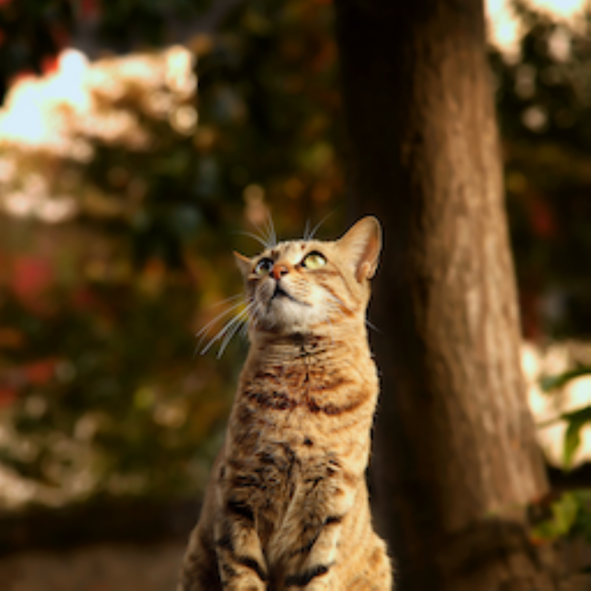
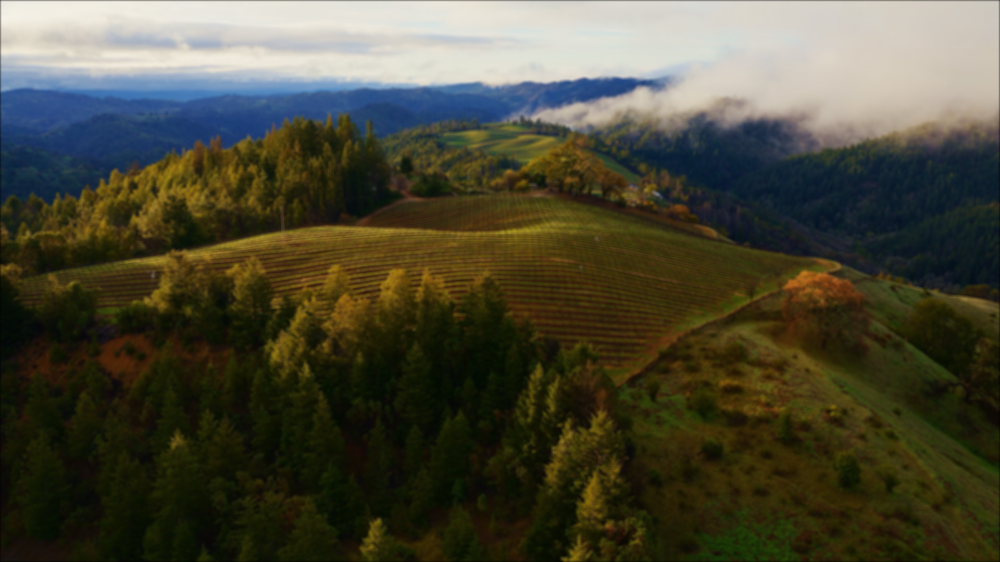

# 💻 컴퓨터 비전 - Lab 1: Image Processing

## 📖 프로젝트 소개

2025년 2학기 서울과학기술대학교 **컴퓨터 비전** 과목의 첫 번째 실습 과제 Lab 1: Image Processing 입니다. 

이 프로젝트는 **OpenCV를 이미지 입출력에만 사용**하고, **NumPy만을 이용하여** 기본적인 이미지 처리 기법들을 직접 구현하는 것을 목표로 합니다.

주요 구현 내용은 이미지 스무딩, 업샘플링, 다운샘플링, 그리고 가우시안 피라미드 생성입니다.

---

## ✨ 주요 구현 내용

### 1. 이미지 스무딩 (Smoothing)
-   **가우시안 필터(Gaussian Filter)**를 직접 구현하여 이미지(`sonoma.png`)에 적용합니다.
-   필터의 **커널 크기(Kernel Size)**와 **표준편차(Sigma)** 값을 변경해가며 스무딩 결과가 어떻게 달라지는지 분석합니다.

### 2. 이미지 업샘플링 (Upsampling)
-   이미지(`cat.png`)를 8배 확대하는 업샘플링을 두 가지 방식으로 구현합니다.
    -   **최근접 이웃 보간법 (Nearest Neighbor Interpolation)**
    -   **양선형 보간법 (Bilinear Interpolation)**
-   두 보간법의 결과물을 비교하여 장단점을 분석합니다.

### 3. 이미지 다운샘플링 (Downsampling)
-   이미지(`sonoma.png`)를 8배 축소하는 다운샘플링을 구현합니다.

### 4. 가우시안 피라미드 (Gaussian Pyramid)
-   가우시안 필터와 다운샘플링을 반복 적용하여 **가우시안 피라미드**를 생성하는 코드를 구현합니다.
-   피라미드의 가장 작은 레벨 이미지(Coarsest Level)를 3번 문제의 다운샘플링 결과와 비교합니다.

---

## 🖼️ 실행 결과 (예시)

#### 업샘플링 결과 비교 (cat.png)

| 원본 | 최근접 이웃 보간법 | 양선형 보간법 |
| :---: | :---: | :---: |
|  |  |  |

<br>

#### 가우시안 스무딩 결과 비교 (sonoma.png)
* **커널 크기 변화 (Sigma = 4 고정)**

| k=3, s=4 | k=7, s=4 | k=11, s=4 |
| :---: | :---: | :---: |
|  |  |  |

---

## ⚙️ 실행 환경
-   Python 3.10.18
-   NumPy
-   OpenCV-Python (`opencv-python`) - 이미지 Read/Write 용도로만 사용

---

## 📁 파일 구조

```
.
├── 01_smoothing.py
├── 02_upsampling.py
├── 03_downsampling.py
├── 04_gaussian_pyramid.py
├── report.pdf
├── cat.png
├── sonoma.png
└── (결과 이미지 파일들...)
```

---

## 📜 저작권 (Copyright)
본 과제물의 모든 코드와 내용의 저작권은 원 출제자이신 **김한울 교수님**께 있습니다.
Copyright © 2025 Han-wool Kim. All Rights Reserved.
